# MelisCore (React back-office) — Functional & Technical Documentation (for AI)

> **What this is.** MelisCore is the **foundation of the Melis back-office** — and, in the new
> **React back-office** (`/melis-react`), it is **the React application itself**. It ships the whole
> React shell (the app, the layout, the routing, the generic `react-api`, the module/brick loader,
> the capability resolver, the New/Old view toggle) **plus** MelisCore's own **native React tools**
> (Users, Dashboard, Announcements, Emails, GDPR, Languages, Logs, Modules, Other config, Platforms,
> Platform theme, My account, and the login/2FA flow). Every other module plugs **into** this shell.
> This document has **two big themes**: **A) the shell / host**, and **B) the native tools**. For the
> underlying data model, services and events, see the [legacy doc](./MelisCore.md); this doc does not
> repeat them.
>
> **How this document is organised — two clearly separated parts:**
> - **[Part A — Functional Guide](#part-a--functional-guide)** — for everyday users (and the chat
>   assistant) using the React back-office. Plain language.
> - **[Part B — Technical Reference](#part-b--technical-reference)** — for developers and AI building
>   inside the React UI, with code (window globals, endpoints, capabilities, code map).
>
> **Audience**: consumed by the **MelisAI** MCP. **Status**: reviewed 2026-08-19.

---

## 0. The React back-office architecture — read this first

This is the map an AI needs before anything else.

### 0.1 What melis-core IS in React

melis-core **is the React back-office base.** The Vite + React 19 + TypeScript + Tailwind app lives in
`vendor/melisplatform/melis-core/ui-react/` (source) and is built to
`vendor/melisplatform/melis-core/public/ui-react/` (the committed build). At runtime:

- **The shell (SPA) is served at `/melis-react`** (by the `MelisReactOverride` module), **in parallel
  with the legacy back-office at `/melis`**. The legacy `.phtml` UI is untouched.
- **The hashed assets load from `/MelisCore/ui-react/`** (served by `MelisAssetManager`; this is the
  Vite `base`). In dev the SPA runs at `/` (`npm run dev`, port 5173, proxied to the Melis backend).
- **The JSON API** the app talks to is under **`/melis/react-api/…`** (contract `{ success, data, error }`).
  Generic endpoints come from the **`MelisReactApi`** bridge module; MelisCore's native tools add their
  own routes/controllers under the same base (see §B2–B3).

### 0.2 The three mechanisms (the key to everything)

Every tool the user sees in `/melis-react` reaches the screen through **one of three mechanisms**:

1. **Native React tool** — a real React page backed by a `MelisReactApi*Controller` in melis-core.
   These are MelisCore's **own** tools and only these; they are listed in the **module registry**
   (`ui-react/src/lib/module-registry.ts` → `MODULES[]`). Examples: Users, Languages, Emails, GDPR.
2. **Module brick (modular)** — another active module ships its **own** React UI as a *brick* loaded at
   runtime (present **iff the module is active**). Discovered via `GET /melis/react-api/react-modules`.
   Reference bricks live in the CMS/commerce/etc. modules (e.g. MelisCalendar, MelisCmsSlider).
3. **Iframe pool** — any legacy tool without a dedicated React route is rendered inside the shell in a
   pooled iframe via `/melis/react-tool-page?key=<melisKey>` (the `MelisReactOverride` mechanism).

A native tool can also carry a **New (React) / Old (iframe)** toggle to compare its React view with the
classic tool loaded in an iframe (`/melis/react-tool-page?key=<melisKey>`).

### 0.3 How the menu, routes and bricks come together

- **The menu is dynamic** — `GET /melis/react-api/menu` returns the rights-filtered tool tree; the
  sidebar is built from it (`hooks/useNavMenu.ts` → `NavNode[]`). Nothing is hardcoded per module.
- **Tool routes are tree-derived** — every tool is mounted at a pretty URL `/[section]/[tool]` derived
  from the menu (`lib/tool-routes.ts`). Native tools map their `forwardKey` (`Module/Controller`) →
  route; bricks do the same; iframe tools register their `melisKey`.
- **Bricks are discovered and loaded at runtime** — `lib/bricks.ts` fetches `/react-modules`, loads the
  concatenated brick bundle, and registers each brick's page/sidebar/topbar/overlay component.
- **Capabilities gate the internals** — a per-tool capability declaration (`config/react.capabilities.php`)
  governs a tool's internal actions (list/create/edit/delete/export). Resolved centrally in
  `lib/caps.ts` / `lib/capabilities.ts` and enforced server-side.

### 0.4 Where the code lives

| Concern | Location |
|---|---|
| React app source | `vendor/melisplatform/melis-core/ui-react/src/` |
| Built app (committed) | `vendor/melisplatform/melis-core/public/ui-react/` |
| Generic react-api (me/menu/assets/react-modules/roles/langs/rights) | module `MelisReactApi` (`vendor/…/melis-react-api`) |
| Native tools' react-api routes + controllers | this module (`config/react-api.php` + `src/Controller/MelisReactApi*`) |
| Native tools' capabilities | this module (`config/react.capabilities.php`) |
| SPA shell + iframe tool mechanism | module `MelisReactOverride` (`vendor/…/melis-react-override`) |

> **In short:** melis-core = the shell (§A "chrome" + Part B B1) **and** the native tools (§A per-tool +
> Part B B3). Other modules extend the same shell via bricks. Business logic stays server-side.

---
---

# PART A — Functional Guide

## A1. What you do in the React back-office

- **Log in** and manage your session (with optional **2FA** and lost-password flows).
- Use the **navigation shell** — the left menu (dynamic tools tree), the top bar, the tabs, your profile.
- Land on the **Dashboard** with at-a-glance widgets.
- Manage **Users, roles & rights** (native React), and the whole family of **System Configuration**
  tools: Platforms, Back-Office Languages, Emails management, Logs, Other config, GDPR, Modules,
  Announcements, Platform theme.
- Every other feature (CMS, News, Commerce, Calendar…) opens **inside** this same shell.

## A2. The back-office chrome (shell)

### A2.1 The top bar (right-side icons)

The top bar's right side holds: a **theme** (light/dark) switch, the **language** switcher, a
**Messenger** icon (when the Messenger module is active), a **notifications** bell, and your **user
avatar** (opens *My account*, and holds *Logout*). A **hide-sidebar** button sits on the far left.

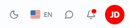
*The top bar's right-side icons — theme toggle, language (EN), messenger, notifications bell, user avatar.*

### A2.2 The left sidebar (menu)

The **Dashboard** link plus the **tools tree**, grouped by section (MelisCore, MelisCms, MelisMarketing,
MelisCommerce, Marketplace, Melis AI…). **What you see depends on your rights** — you only see tools you
are allowed to use. Sections and tools are dynamic (driven by the menu API); a single-tool section is
collapsed to a clickable entry.

### A2.3 The footer (version)

The footer shows the platform / MelisCore **version** — handy when reporting an issue.

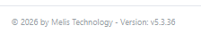
*The footer — MelisCore / platform version (e.g. v5.3.36).*

### A2.4 The Dashboard

Your landing page after login. It shows top **bubbles** (Melis News / Updates / Notifications /
Messages counts) and a grid of **widgets** (dashboard plugins). You add widgets from the **"Add a
widget"** palette and arrange them by drag-and-drop; which ones are available depends on your rights.

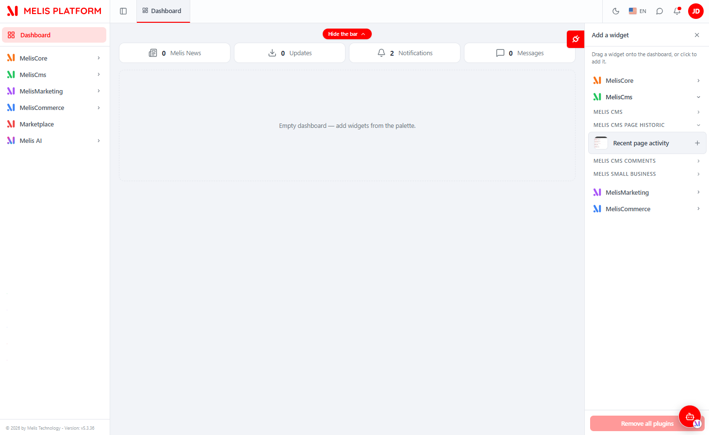
*The React Dashboard — top bubbles, an empty widget grid, and the "Add a widget" palette (grouped by module) with "Remove all plugins".*

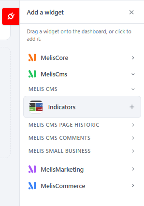
*The "Add a widget" palette — pick a widget (e.g. MelisCms → "Indicators") to drop onto the dashboard.*

## A3. Logging in (auth)

**Where:** `/melis-react/login` (React) — enter **username** + **password**, optional **Remember me**,
and a language selector. On success you land on the Dashboard. If the account has **2FA**, you are sent
to a code-verification screen (`/verify-2fa`); if the code is emailed you can request a new one. The
**Lost password** link (`/forgot-password`) emails a reset link that opens `/reset-password/:hash`.
The login panel branding (logos, title/subtitle) is configurable via the **Platform theme** tool (§A14).

## A4. Users, roles & rights (native React)

**Where:** sidebar → **MelisCore → Administration → User management** (tree route `/melis-core/user`).

Manage every back-office account. The list has **KPI cards** (Total / Active / Inactive / Admins), a
**search** box, **status** and **role** filters, a **Columns** manager, **Export**, the **New/Old**
toggle and **+ New user**. Each row edits or deletes a user.

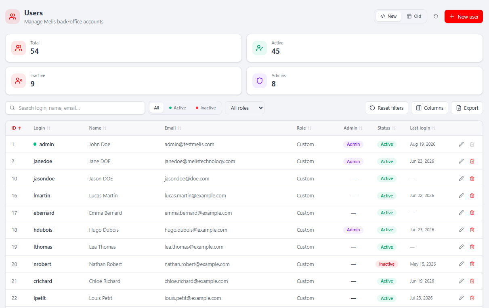
*The React Users tool — KPI cards, search, status & role filters, column manager, Export, New/Old toggle, "+ New user", per-row edit/delete.*

Opening a user gives four **tabs**:

- **Profile** — first/last name, login, email, **tags**, status toggle, **role**, an **Administrator**
  flag, and a password section with live complexity feedback.

  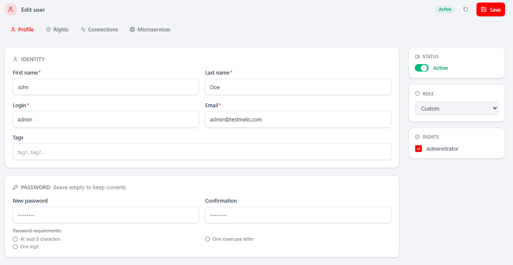
  *The Profile tab — identity, tags, Status/Role/Rights side cards, and a password field with live requirements.*

- **Rights** — the **access tree** (tick which tools/sections the user may use), plus a **Dashboard
  Plugins** panel and a **Pages** panel. Anything not granted is hidden from the user's menu. Tools that
  declare **capabilities** expose sub-checkboxes (List / Create / Edit / Delete / Export…).

  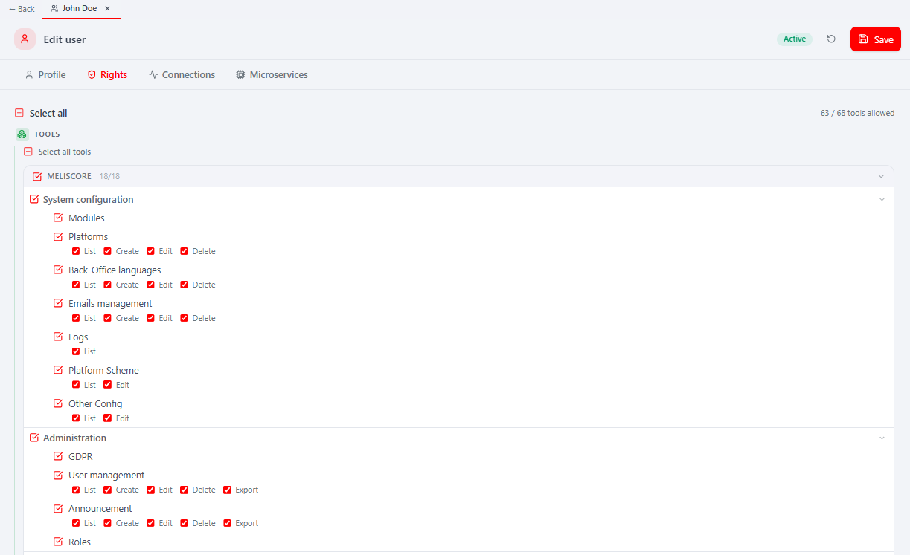
  *The rights tree — Select all, per-section tallies (e.g. "63 / 68 tools allowed"), and per-tool capability checkboxes.*

  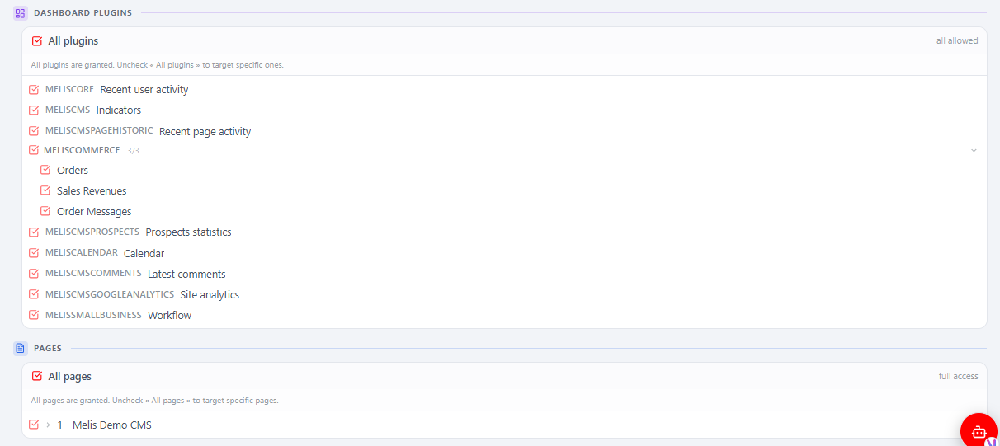
  *Lower in the Rights tab — the Dashboard Plugins panel (per-module widgets) and the Pages panel ("All pages" / per-page grants).*

- **Connections** — the user's **login history** (date, time in / out, connection duration).

  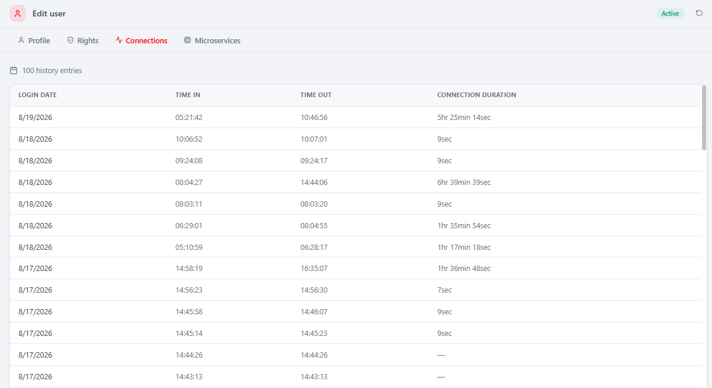
  *The Connections tab — login history entries with durations.*

- **Microservices** — generate an **API key** so third parties can authenticate as this user against
  the micro-service endpoints.

  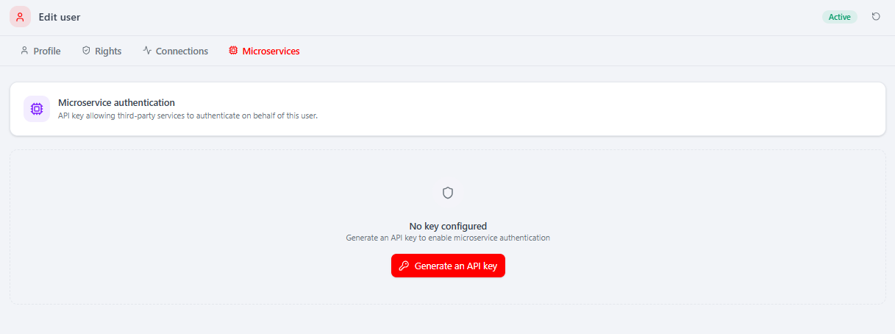
  *No key yet — "Generate an API key" to enable microservice authentication.*

  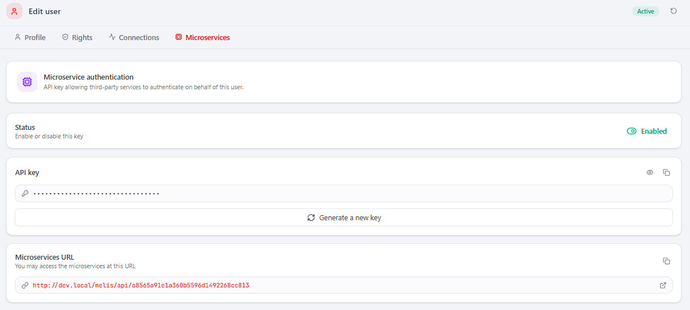
  *A generated key — enable/disable toggle, the masked key (with show/copy/regenerate), and the microservice URL.*

**Roles** define a set of rights once and assign it to many users — the **Roles** tool is contributed by
**MelisSmallBusiness** (see that module's docs); the Profile tab's *Role* selector appears only when that
module is active.

> Rule of thumb: if someone "can't see a tool", their **Rights** tree doesn't grant it. Edit the user
> (or their role) → **Rights** → tick the tool.

## A5. My account

**Where:** top-bar avatar → **My account** (route `/melis-core/account`). Edit your own email, change
your **password**, and set your **interface language**; upload a profile picture. Modules can add tabs
here — e.g. **Melis Messenger** adds a tab.

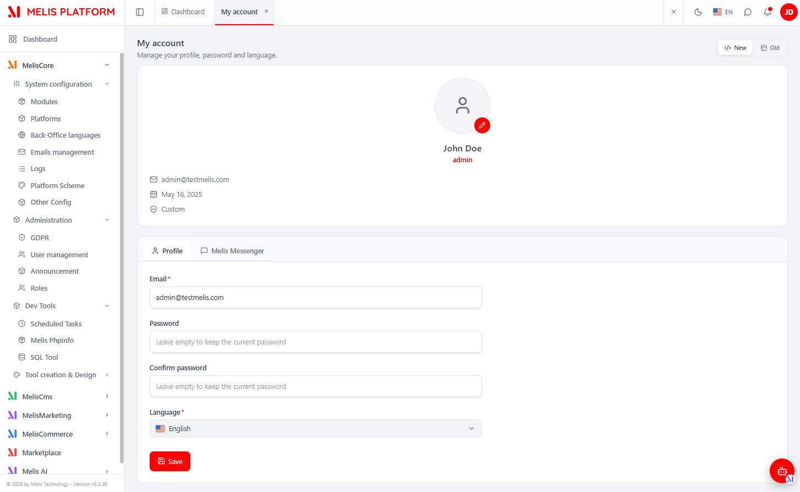
*The React "My account" page — avatar, identity summary, and a Profile tab (email / password / language). A "Melis Messenger" tab is added by that module.*

## A6. Announcements

**Where:** sidebar → **MelisCore → Administration → Announcement** (`/melis-core/announcement`).
Platform announcements shown on the dashboard. KPI cards (Total / Active / Inactive), search, status
filter, Columns, Export, New/Old toggle and **+ New announcement**.

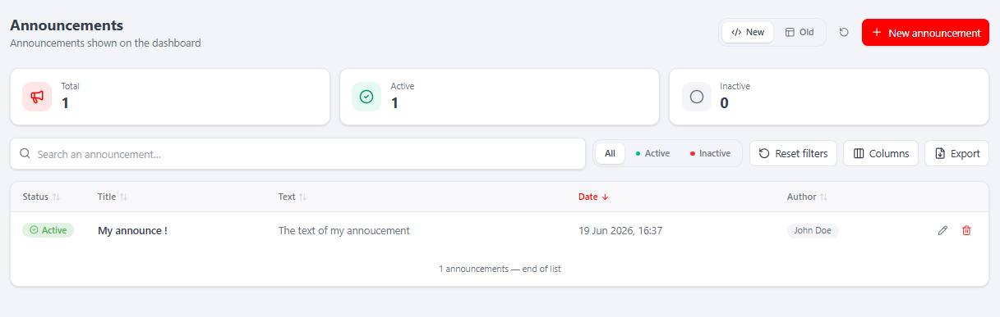
*The Announcements list — KPI cards, search, Active/Inactive filter, per-row edit/delete.*

The editor is a title + **rich-text (TinyMCE)** body, an **Active** toggle and a **Date**.

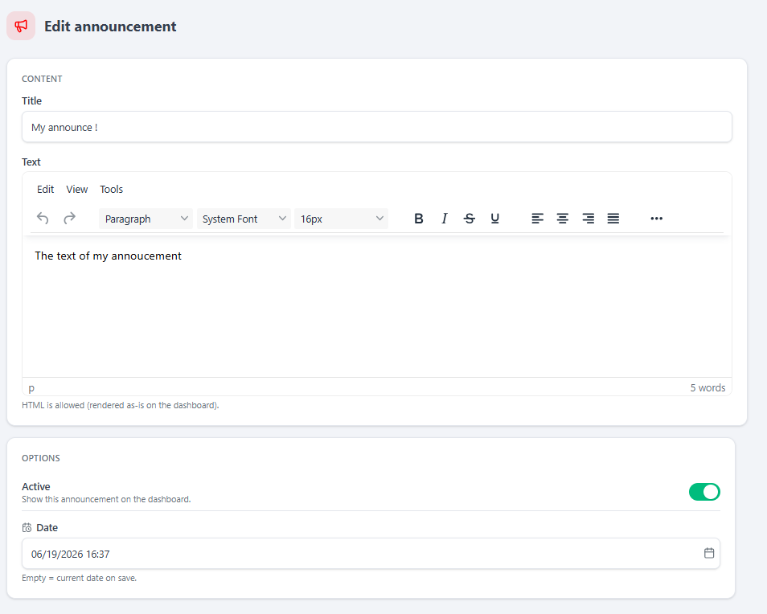
*The announcement editor — Title, HTML Text (TinyMCE), Active toggle and Date.*

## A7. Back-Office Languages

**Where:** sidebar → **MelisCore → System configuration → Back-Office languages** (`/melis-core/language`).
The languages (locale + name) available to back-office users. `en_EN` is the **protected default**
(can't be renamed away or deleted). New/Old toggle, search, Columns, **+ New language**.

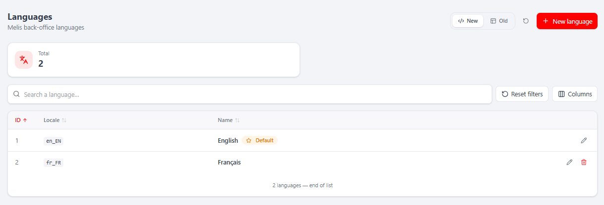
*The Languages list — locale + name, the default (en_EN) flagged, per-row edit; French deletable.*

## A8. Emails management

**Where:** sidebar → **MelisCore → System configuration → Emails management** (`/melis-core/emails`).
The platform's **transactional emails** (account creation, lost password, workflow…). The list shows
name, **code**, sender/sender-email and a **Source** badge (Default vs Custom).

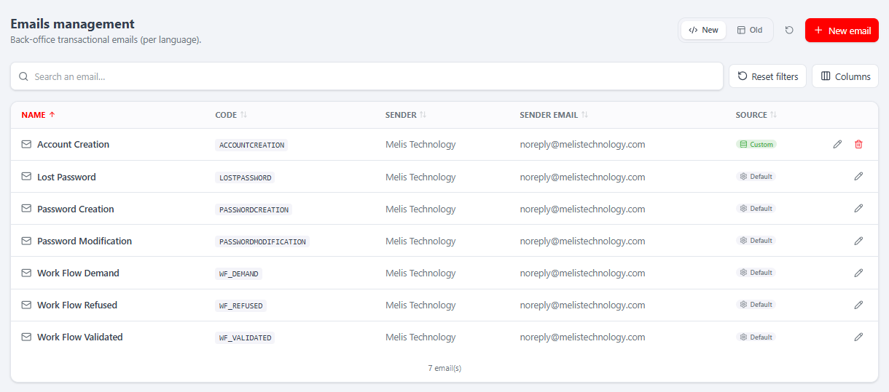
*The Emails management list — transactional templates with their code, sender and Default/Custom source.*

The editor has **General properties** (name, code, sender, reply-to, replacement tags, layout) and a
**Content per language** section (subject + HTML/text body per language) with replaceable tags like
`[NAME]`, `[EMAIL]`, `[LOGIN]`.

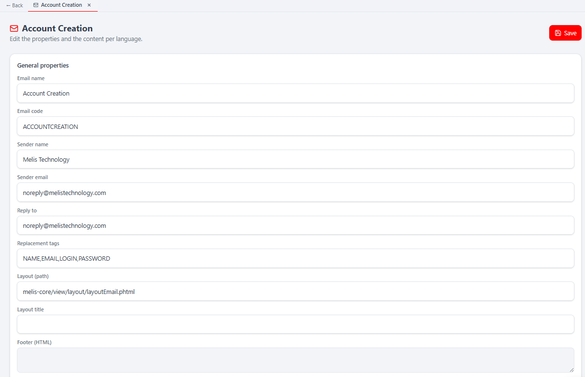
*The email properties — name, code, sender, reply-to, replacement tags and the layout path.*

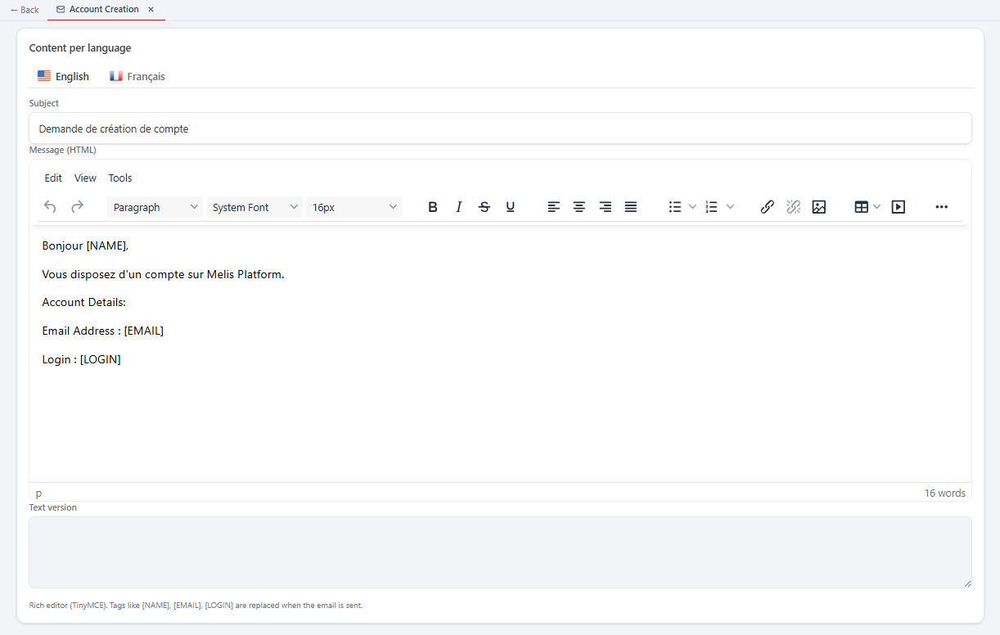
*The per-language content — subject + a TinyMCE HTML body with `[NAME]`/`[EMAIL]`/`[LOGIN]` tags, plus a plain-text version.*

## A9. GDPR

**Where:** sidebar → **MelisCore → Administration → GDPR** (`/melis-core/gdpr`). Four tabs:

- **Data** — search a person by name/email; across all modules, see the data held on them, then
  **extract** (export XML) or **delete** the selected records.

  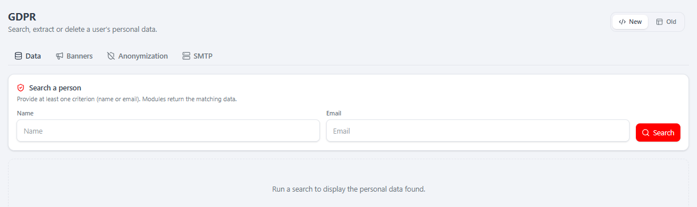
  *The GDPR Data tab — search a person (name or email); modules return the matching data to extract or delete.*

- **Banners** — configure the GDPR cookie/consent banner texts per site + language.
- **Anonymization** — the scheduled **auto-delete / data-retention** configs (one per site + module),
  with **Run** and **Logs**.

  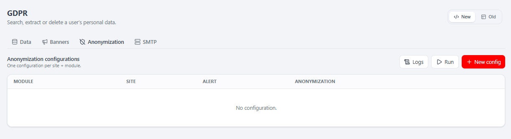
  *The Anonymization tab — auto-delete configurations (module / site / alert / anonymization), with Logs, Run and "+ New config".*

- **SMTP** — the mail server used to send anonymization alert emails.

  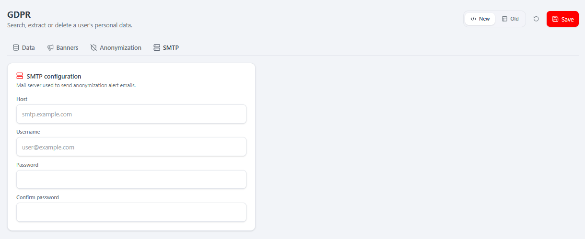
  *The SMTP tab — host / username / password for anonymization alert emails.*

## A10. Logs

**Where:** sidebar → **MelisCore → System configuration → Logs** (`/melis-core/logs`). A read-only,
searchable **activity log** — filter by type, title, user and date range. KPI cards (Total / Today /
Types). Non-admins see only their own actions.

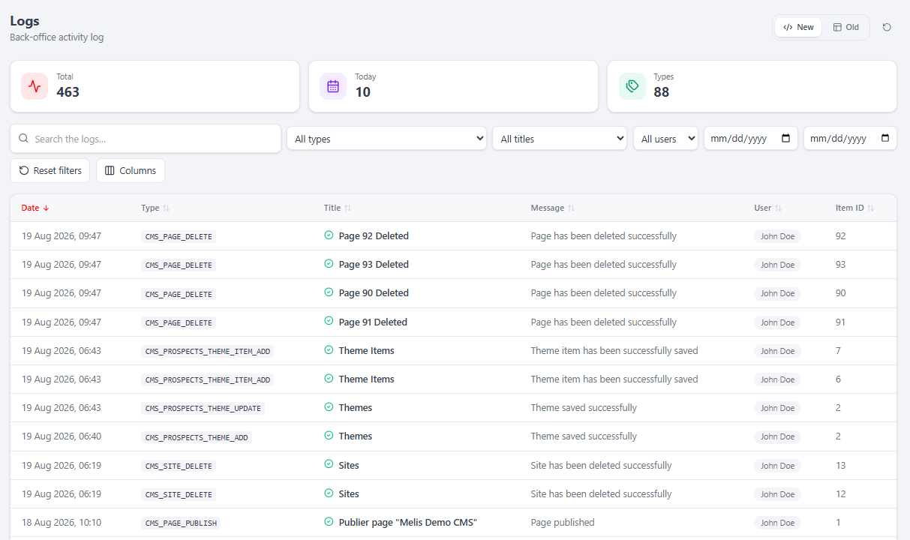
*The Logs viewer — KPI cards, type/title/user/date filters, and rows (date, type, title, message, user, item id).*

## A11. Modules

**Where:** sidebar → **MelisCore → System configuration → Modules** (`/melis-core/modules`). Enable /
disable and **reorder** (drag-and-drop) the platform modules. Search, "N / M active", Enable all /
Disable all, and **Save**. Each row shows the module, its package, version and dependencies.

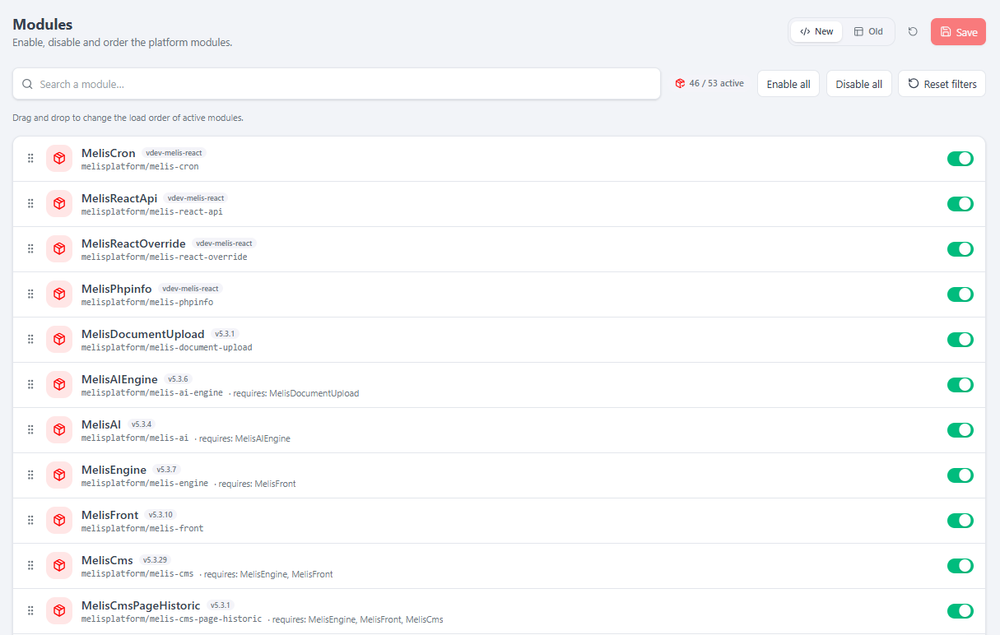
*The Modules tool — search, active count, drag-to-reorder load order, per-module enable toggle, requires/version badges.*

## A12. Other config (login & password policy)

**Where:** sidebar → **MelisCore → System configuration → Other Config** (`/melis-core/other-config`).
The security policy: **account lockout after failures**, **password validity duration**, **password
reuse**, and **password complexity** (min length + lower/upper/digit/special requirements).

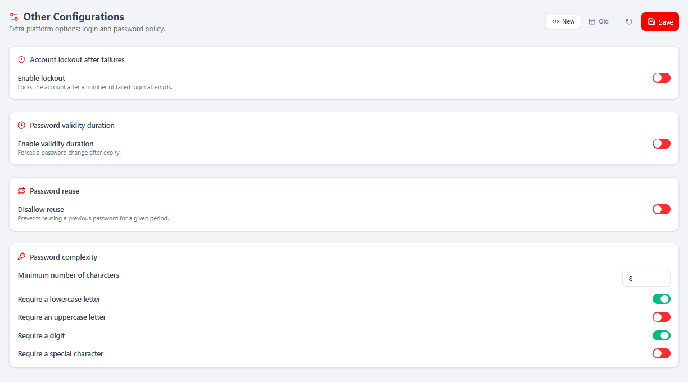
*The Other Configurations page — account lockout, password validity, password reuse, and password complexity toggles.*

## A13. Platforms

**Where:** sidebar → **MelisCore → System configuration → Platforms** (`/melis-core/platforms`). Manage
the **environments** (dev/staging/prod). KPI cards (Total / Marketplace enabled / Cache enabled), search,
Columns, New/Old toggle, **+ New platform**. The **current** platform is flagged and its name can't be
changed.

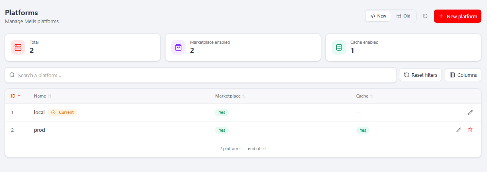
*The Platforms list — the "current" platform flagged, Marketplace/Cache columns, per-row edit/delete.*

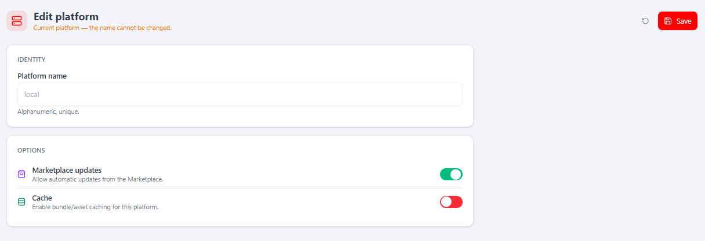
*The platform editor — name (locked for the current platform), Marketplace updates and Cache toggles.*

## A14. Platform theme

**Where:** sidebar → **MelisCore → System configuration → Platform Scheme** (`/melis-core/platform-scheme`).
Configure the back-office **branding**: the header logo, and the **login left-panel** (logo, background,
and per-language title/subtitle), plus favicon. **Restore to Default** resets it.

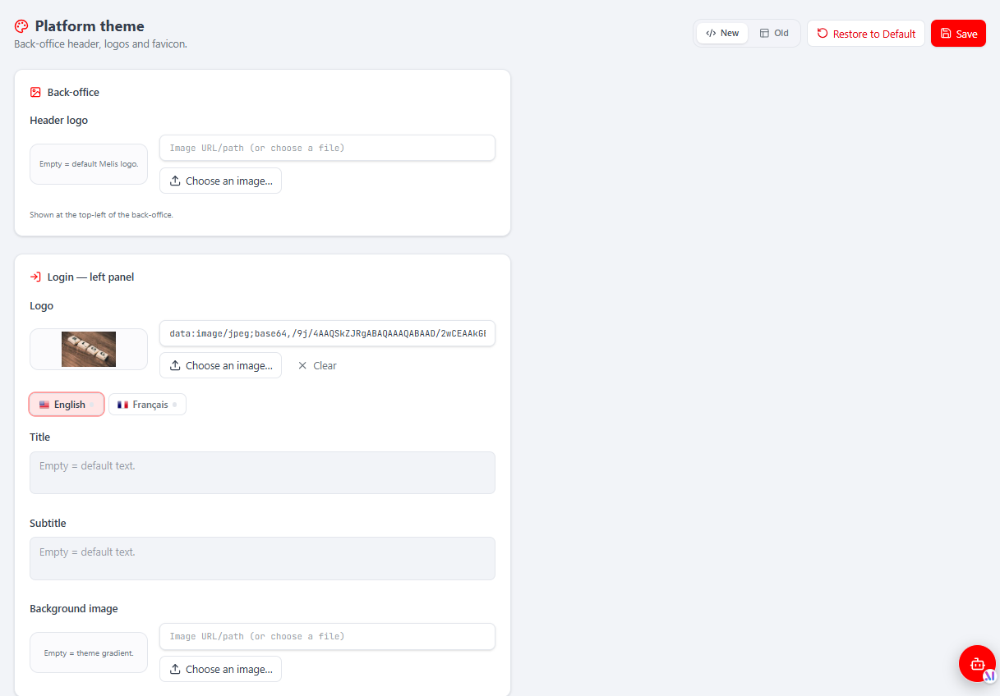
*The Platform theme page — back-office header logo and the login left-panel (logo, per-language title/subtitle, background image), New/Old toggle, Restore to Default, Save.*

> **Note.** In React there are **two theme controllers**: this **Platform theme** page (logos / login
> branding / favicon — the *React* theme) and the legacy **colour scheme** (BO colours). Both are keyed
> under the same rights node `meliscore_tool_platform_scheme` (see §B3, §B4).

## A15. Common tasks — "How do I…?"

- **Log in** → `/melis-react/login`. **Reset a password** → *Lost password* → email link → `/reset-password/:hash`.
- **Add a back-office user** → User management → **+ New user** → Profile → assign **Rights** → Save.
- **Give access to a tool (or hide one)** → User management → edit the user (or role) → **Rights** tree.
- **Restrict a tool's actions** (e.g. hide *Delete*) → Rights tree → the tool's **capability** checkboxes.
- **Change the password policy** → System configuration → **Other Config**.
- **Edit the "account created" email** → System configuration → **Emails management** → *Account Creation*.
- **Add a language** → System configuration → **Back-Office languages** → **+ New language**.
- **Enable/disable or reorder a feature** → System configuration → **Modules** → toggle / drag → **Save**.
- **Handle a GDPR request** → Administration → **GDPR → Data** → search → extract / delete.
- **Give a colleague API access** → User management → edit user → **Microservices** → generate a key.
- **Rebrand the back-office / login screen** → System configuration → **Platform Scheme**.
- **Change my own password / language** → top-bar avatar → **My account**.
- **Compare a tool's React vs classic view** → the tool's top-right **New / Old** toggle.

---
---

# PART B — Technical Reference

*melis-core is the React host. B1 documents the shell/host contracts, B2 the generic react-api, B3 the
native tools' react-api, B4 the capabilities, B5 the code map.*

## B1. The shell / host contracts

### B1.1 Bootstrap, window globals & `__melisRegisterBrick` (`ui-react/src/main.tsx`)

The host exposes its React singletons on `window` so **brick bundles** (built as IIFE with React
externalised) reuse the host instance — hooks, context and Router work across the boundary:

```ts
window.MelisReact          = React
window.MelisReactDOM       = ReactDOM
window.MelisReactJsxRuntime= ReactJsxRuntime
window.MelisReactRouterDOM = ReactRouterDOM
window.MelisXLSX           = XLSX            // shared Excel/CSV export
window.__MELIS_BRICK_COMPONENTS__ = {}       // brick id → registered components
window.__melisIsModuleActive = isModuleActive
window.__melisUseCaps        = useCaps        // central capability hook (lib/caps.ts)
window.__melisRegisterBrick  = (b) => { … }   // a brick registers itself here
```

A brick registers up to five optional pieces (all modular):

```ts
window.__melisRegisterBrick?.({
  id: 'calendar',              // MUST match brick.manifest.json id
  Component,                   // a routed page rendered in the content area
  Sidebar,                     // a left-sidebar panel under the module's nav section
  Header,                      // a topbar widget (e.g. the Messenger bell)
  Overlay,                     // a shell-root overlay (e.g. the MelisAI assistant FAB)
  OtherConfigSection,          // a section appended to MelisCore's Other Config page
})
```

### B1.2 Routing (`ui-react/src/App.tsx`)

`<BrowserRouter basename={PROD ? '/melis-react' : '/'}>`. Public routes: `/login`, `/verify-2fa`
(both `PublicOnlyRoute`), `/forgot-password`, `/reset-password/:hash`, `/setup`. Everything else is
under `ProtectedRoute` → `Shell`. Routes are **derived, not hardcoded**:

- Native tools: `MODULES.map()` mounts each at its tree route `routeForForward(m.forwardKey)`, plus
  `…/new` and `…/:id` when it has a form.
- Bricks: mounted at `brickRoute(b)` (+ `/:id`) with `element={null}` (Shell renders them directly).
- Static native route `/melis-core/account` → `AccountPage`.
- Catch-all `/:section/:tool/*` → `ZonePage` (the iframe pool), then `*` → `PlaceholderPage`.

`TabBridge` exposes `window.__melisOpenTab` / `__melisCloseTab`, keeps the active tab aligned with the
route, and handles cross-window `postMessage({ __melisOpenTool, forwardKey|path|melisKey, id?, label? })`
so an iframe tool can open another tool as a top-level tab.

### B1.3 Layout / Shell (`ui-react/src/components/layout/`)

`Shell.tsx` composes `Sidebar` + `Topbar` + `SubTabBar` + `ToolTabBar` + the content `<main>`. Key
behaviours: **persistent native lists** (from `PERSISTENT_MODULES`) are mounted on first visit and only
CSS-hidden afterwards (so a New/Old iframe survives navigation); **bricks** render through `BrickHost`
(persistent bricks kept mounted, isolated in their own routing context via `UNSAFE_RouteContext`); the
**Dashboard** is lazy-mounted then kept in the DOM; the **iframe pool** (`ZoneFrames`) is always mounted.
Every tool mount is wrapped in a **`ToolErrorBoundary`** (§B1.8). `refreshActiveModules()` runs on each
navigation so module-gated UI reacts to a module being toggled without a full reload.

Other layout pieces: `Sidebar.tsx` (dynamic menu), `Topbar.tsx` (right-side icons + avatar/account),
`SubTabBar.tsx` (native sub-tabs), `ToolTabBar.tsx` (legacy iframe tabs), `MelisToolFrame.tsx`.

### B1.4 Module registry (`ui-react/src/lib/module-registry.ts`) — native tools only

`MODULES: ReactModuleDef[]` lists **only MelisCore's own** native tools. Each entry drives routes, nav
mapping, persistent mounting and the New/Old toggle:

| id | route (fallback) | forwardKey (`Module/Controller`) | melisKey (Old iframe) | list / form |
|---|---|---|---|---|
| `users` | `/users` | `MelisCore/ToolUser` | `meliscore_tool_user` | UserListPage / UserFormPage |
| `platforms` | `/platforms` | `MelisCore/Platforms` | `meliscore_tool_platform` | PlatformListPage / PlatformFormPage |
| `languages` | `/languages` | `MelisCore/Language` | `meliscore_tool_language` | LanguageListPage / LanguageFormPage |
| `logs` | `/logs` | `MelisCore/Log` | `meliscore_logs_tool` | LogListPage (read-only, no form) |
| `announcements` | `/announcements` | `MelisCore/Announcement` | `melis_core_announcement_tool` | AnnouncementListPage / AnnouncementFormPage |
| `modules` | `/modules` | `MelisCore/Modules` | `meliscore_tool_user_module_management` | ModulesPage (special) |
| `gdpr` | `/gdpr` | `MelisCore/MelisCoreGdpr` | `melis_core_gdpr` | GdprPage (special) |
| `emails` | `/emails` | `MelisCore/EmailsManagement` | `meliscore_tool_emails_mngt` | EmailListPage / EmailFormPage |
| `otherconfig` | `/otherconfig` | `MelisCore/MelisCoreOtherConfig` | `meliscore_tool_other_config` | OtherConfigPage (special) |
| `platformscheme` | `/platform-scheme` | `MelisCore/PlatformScheme` | `meliscore_tool_platform_scheme` | PlatformSchemePage (special) |

All entries are `persistent: true` and `viewToggle: true`. Derived exports: `PERSISTENT_MODULES`,
`REACT_ROUTES` (`forwardKey` → route), and `toolHasViewToggle(id)`. The real mount URL is the
**tree route** `/[section]/[tool]` from the menu (e.g. `/melis-core/user`), not the fallback `route`.

> **Every native tool page maps to a controller + capability**: `users → MelisReactApiUserController
> (meliscore_tool_user)`, `platforms → …Platform (meliscore_tool_platform)`, `languages → …Language
> (meliscore_tool_language)`, `logs → …Log (meliscore_logs_tool)`, `announcements → …Announcement
> (melis_core_announcement_tool)`, `emails → …Emails (meliscore_tool_emails_mngt)`, `gdpr → …Gdpr
> (melis_core_gdpr)`, `otherconfig → …OtherConfig (meliscore_tool_other_config)`, `platformscheme →
> …PlatformScheme + …PlatformSchemeReact (meliscore_tool_platform_scheme)`, `modules → …Modules
> (meliscore_tool_user_module_management)`, plus `account → MelisReactApiUserProfileController` (no cap).

### B1.5 Brick loader (`ui-react/src/lib/bricks.ts`)

`loadBricks()` fetches `/react-modules`, registers each active brick's `forwardKey → route`
(`BRICK_ROUTES`), and loads the **one server-concatenated bundle**
`/melis/react-api/bricks-bundle.js?v=<signature>` (falls back to per-brick scripts). Each brick page is a
`React.lazy` that awaits the bundle then reads its registered `Component`. Exports include:
`useBricks()`, `brickRoute(b)`, `sidebarBrickForModules()`, `headerBricks()`, `overlayBricks()`,
`otherConfigSectionBricks()`, and **`isModuleActive(name)` / `useModuleActive(name)`** (a module is
active iff it ships a brick listed in `/react-modules`; `refreshActiveModules()` re-fetches on
navigation).

### B1.6 Tool routes (`ui-react/src/lib/tool-routes.ts`)

Builds the `route ↔ melisKey / forwardKey / label` registry while walking the menu (`registerTool`),
persisted to `sessionStorage` for instant deep-link resolution. Key helpers: `sectionSlug()`,
`toolSlug()`, `toolSlugForForward()` (with `TOOL_SLUG_OVERRIDES` for clean URLs, e.g. `MelisCore/Modules
→ modules`, `MelisCore/EmailsManagement → emails`), `melisKeyForRoute()`, `routeForForward()`,
`routeForMelisKey()`, `labelForRoute()`, `hasToolRoutes()`, `useToolRoutesVersion()`, `clearTools()`.

### B1.7 New/Old view toggle (`lib/tool-view-mode.ts` + `components/MelisClassicView.tsx`)

`MelisClassicView.tsx` exports `<ViewModeToggle mode onChange>` (`type ViewMode = 'react' | 'iframe'`)
and `<MelisClassicFrame melisKey title visible loaded />` — the Old view iframes
`/melis/react-tool-page?key=<melisKey>` and stays mounted (CSS-hidden) after first load.
`tool-view-mode.ts` exposes `window.__melisSetToolView(melisKey, view)` and the hooks
`useToolView(melisKey)` / `usePublishedToolView(melisKey)` so the host can hide React sub-tabs while the
Old view is active. A tool shows the toggle per its registry `viewToggle` flag (`toolHasViewToggle(id)`).

### B1.8 Error isolation & notifications

- **`ToolErrorBoundary`** (`components/ToolErrorBoundary.tsx`) — a class error boundary wrapping **every**
  tool mount so a single tool's render crash never blanks the whole back-office; shows a localised
  message + a Retry button, keeping the menu and other tools intact.
- **`Notifications`** (`components/Notifications.tsx`) — top-right toasts (`ok`/`ko`), fed by
  `postMessage({ __melisNotif, kind, title, message, fields })` (de-duped) from both React tools and
  legacy iframe tools (`melisOkNotification`/`melisKoNotification` are bridged in `buildToolPage`).

### B1.9 i18n, theme, auth

- **i18n** — `I18nProvider` / `useI18n()`; the session locale drives `document.documentElement.lang`;
  public pages fetch translations via `GET /melis/react-api/i18n?locale=…`; language change via
  `GET /melis/change-language?langId=…`.
- **Theme** — `ThemeProvider` (light/dark) + `lib/react-theme.ts` (`loadReactTheme()` applies the
  configurable BO branding).
- **Auth** — `auth/AuthProvider.tsx`, `ProtectedRoute.tsx`, `PublicOnlyRoute.tsx`, `auth-context.ts`.
  Login/logout/2FA/reset live in `lib/melis-api.ts` (`login`, `verifyTwoFaCode`, `requestNewTwoFaCode`,
  `isLoggedIn`, `checkSession`, `requestPasswordReset`, `resetPassword`, `logout`). Login posts to the
  **legacy** `POST /melis/authenticate`; session polling uses `GET /melis/islogin`.

## B2. The generic react-api (module `MelisReactApi`)

These endpoints are **not** in melis-core — they come from the `MelisReactApi` bridge module and are
consumed by the shell (`lib/melis-api.ts`). Base `/melis/react-api`, contract `{ success, data, error }`,
every call sends `X-Requested-With: XMLHttpRequest` + `credentials: 'include'`.

| Method & URL | Purpose | Client fn |
|---|---|---|
| `GET /melis/react-api/me` | Current user (`id, name, login, email, picture, isAdmin, capabilities`) | `fetchMe` |
| `GET /melis/react-api/menu[?full=1]` | Rights-filtered tool tree (`ApiMenuNode[]`); `full=1` = unfiltered, rights editor only | `fetchMenu` |
| `GET /melis/react-api/assets` | Platform CSS/JS asset list (bundle-aware) | `fetchAssets` |
| `GET /melis/react-api/langs` | BO languages + current session locale | `fetchLangs` |
| `GET /melis/react-api/react-modules` | Active modules shipping a brick + concatenated bundle URL | `fetchReactModules` |
| `GET /melis/react-api/rights/capabilities` | Declared per-tool capabilities (for the rights editor) | `fetchDeclaredCapabilities` |
| `GET /melis/react-api/i18n?locale=…` | Public login/forgot/reset translations | `fetchI18n` |
| `GET /melis/react-api/dashboard/{bubbles,stats,layout,legacy-plugins}` · `POST …/layout` | Dashboard data + shared layout persistence | `fetchDashboard*` |

Non-react-api endpoints the shell also uses: `GET /melis/islogin`, `POST /melis/authenticate`,
`GET /melis/logout`, `GET /melis/zoneview?cpath=<melisKey>`,
`GET /melis/MelisCore/MelisFlashMessenger/{getflashMessage,clearFlashMessage}`,
`GET /melis/change-language?langId=…`.

> **Note.** The MelisCore *user-roles* dropdown lives at `GET /melis/react-api/roles`
> (`MelisReactApiUserController::rolesAction`, §B3). The richer **Roles CRUD tool** (`/roles-list`,
> `/roles/save`, …) belongs to **MelisSmallBusiness**, not melis-core.

## B3. The native tools' react-api (this module)

Routes are declared in **`config/react-api.php`** (merged via `MelisCore\Module::getConfig()`) under
`/melis/react-api/…`; controllers are in `src/Controller/MelisReactApi*Controller.php`. All extend
`MelisCore\Controller\MelisAbstractActionController` and (except Auth/UserProfile) `use
MelisReactApi\Controller\CapabilityGuardTrait`. Each guarded action does:

```php
private const MELIS_KEY = 'meliscore_tool_user';
if ($deny    = $this->denyUnlessAccess())        { return $deny; }    // 401 unauth / 403 canAccess(MELIS_KEY)
if ($denyCap = $this->denyUnlessCan('list'))     { return $denyCap; } // capability (CapabilityGuardTrait, default-allow)
```

Response shape everywhere: `{ success, data }` on OK, `{ success:false, error, …}` on failure. The
shared **`MelisReactKeysetListTrait`** (`keysetList()`, whitelisted sort + keyset pagination →
`[rows,total,nextCursor]`) is used by Announcement, Language, Log, Platform.

### B3.1 `MelisReactApiUserController` — guard `meliscore_tool_user`
Base `/melis/react-api/users` (+ `/roles`). Actions: `list` (`list`), `stats` (`list`),
`get` (`edit`), `save` (`create`|`edit`), `delete` (`delete`, blocks self-delete), `connections`
(`edit`), `microservice`/`microserviceSave` (`edit`), `roles` (`list`, at `/roles`),
`passwordPolicy` (`list`, at `/users/password-policy`). Services: `Laminas\Db\Adapter\AdapterInterface`,
`MelisCoreAuth`, `MelisCoreConfig`, `MelisCoreUser`, EventManager (`meliscore_tooluser_*` events).

### B3.2 `MelisReactApiUserProfileController` — guard `meliscore_user_profile` (auth-only, no capability)
Base `/melis/react-api/user-profile`. Actions: `get`, `save` (own email/lang/password/avatar; refreshes
the session). Services: `MelisCoreAuth`, DB adapter; validator `MelisPasswordValidator`. **No
`CapabilityGuardTrait`** — open to any authenticated user (this is *My account*).

### B3.3 `MelisReactApiAnnouncementController` — guard `melis_core_announcement_tool`
Base `/melis/react-api/announcements`. Actions: `list` (`list`), `stats` (`list`), `get` (`edit`),
`save` (`create`|`edit`, forces author = current user), `delete` (`delete`). Uses the keyset trait.

### B3.4 `MelisReactApiEmailsController` — guard `meliscore_tool_emails_mngt`
Base `/melis/react-api/emails`. Actions: `list` (`list`, merges config + DB templates),
`get` (access-only, no cap — header + per-language content), `save` (`create`|`edit`, delegates to
`MelisCoreBOEmailService::saveBoEmailByCode`), `delete` (`delete`). Note routes: `/emails/save`
(priority 100), `/emails/delete/:codename`, `/emails/:codename`.

### B3.5 `MelisReactApiGdprController` — guard `melis_core_gdpr`
Base `/melis/react-api/gdpr`. **Data**: `search` (`list` → `MelisCoreGdprService::getUserInfo`),
`extract` (`export` → `extractSelected`), `delete` (`delete` → `deleteSelected`). **SMTP**
(`/gdpr/smtp[…]`): `smtpGet` (no cap), `smtpSave` (`edit`), `smtpDelete` (`delete`). **Banners**
(`/gdpr/banner[…]`): `bannerMeta`/`bannerGet` (no cap), `bannerSave` (`edit`). **Auto-Delete**
(`/gdpr/autodelete/…`): `adMeta`/`adConfigs`/`adConfig`/`adLogs`/`adLogDetail` (no cap), `adSave`/`adRun`
(`edit`), `adDelete` (`delete`). Services: `MelisCoreGdprService`, `MelisCoreGdprAutoDeleteToolService`,
`MelisCoreGdprAutoDeleteService`, `MelisGdprService`, SMTP/log tables.

### B3.6 `MelisReactApiLanguageController` — guard `meliscore_tool_language`
Base `/melis/react-api/languages`. Actions: `list` (`list`), `stats` (`list`), `get` (`edit`),
`save` (`create`|`edit`; locale format + uniqueness; `en_EN` protected; regenerates translation files via
`MelisCoreTranslation`), `delete` (`delete`; `en_EN` protected). Keyset trait.

### B3.7 `MelisReactApiLogController` — guard `meliscore_logs_tool` (read-only)
Base `/melis/react-api/logs`. Actions: `list` (`list`; non-admins scoped to own logs), `stats` (`list`),
`filters` (`list`; filter options + isAdmin). Services: DB adapter, `MelisCoreLogService`, translator.

### B3.8 `MelisReactApiModulesController` — guard `meliscore_tool_user_module_management`
Base `/melis/react-api/modules`. Actions: `list` (`list`; ordered modules w/ active/version/requires via
`ModulesService`), `save` (`edit`; rewrites `config/melis.module.load.php` via `createModuleLoader`,
fires `meliscore_module_management_save_end`).

### B3.9 `MelisReactApiOtherConfigController` — guard `meliscore_tool_other_config`
Base `/melis/react-api/otherconfig`. Actions: `get` (`list`; effective login/password policy via
`MelisCoreConfig`), `save` (`edit`; validates + writes `app.login.php` via `MelisPasswordSettingsService`;
422 + `fields` on validation failure).

### B3.10 `MelisReactApiPlatformController` — guard `meliscore_tool_platform`
Base `/melis/react-api/platforms`. Actions: `list` (`list`), `stats` (`list`), `get` (`edit`),
`save` (`create`|`edit`; alphanumeric + unique name; current platform can't be renamed), `delete`
(`delete`; current platform protected). Keyset trait.

### B3.11 `MelisReactApiPlatformSchemeController` — guard `meliscore_tool_platform_scheme` (legacy colours)
Base `/melis/react-api/platformscheme`. Actions: `get` (`list`), `save` (`edit`; regenerates
`schemes.css`), `reset` (`edit`). Service: `MelisCorePlatformSchemeService`.

### B3.12 `MelisReactApiPlatformSchemeReactController` — guard `meliscore_tool_platform_scheme` (React branding)
Base `/melis/react-api/platformscheme-react`. Actions: `get` (**public/pre-auth**, no guard — login-panel
branding + languages + core version), `save` (`edit`; mono-value fields + per-language translations),
`reset` (`edit`). Service: `MelisCorePlatformSchemeReactService`.

### B3.13 `MelisReactApiAuthController` — public (no guard)
Base `/melis/react-api`. Actions: `forgotPassword` (`/forgot-password`; hashed request +
`MelisCoreBOEmailService::sendBoEmailByCode('LOSTPASSWORD',…)`), `resetPassword` (`/reset-password`;
validates hash + complexity), `i18n` (`/i18n`; login/forgot/reset translations). Uses
`message` (not `error`) for user-facing text.

Example (a native list + save):

```ts
// GET a keyset page of platforms
const r = await fetch('/melis/react-api/platforms?limit=25&sort=plf_id&dir=desc', {
  headers: { 'X-Requested-With': 'XMLHttpRequest' }, credentials: 'include',
})
const { success, data } = await r.json()   // { success, data: { items, total, nextCursor } }

// POST save a language
await fetch('/melis/react-api/languages/save', {
  method: 'POST',
  headers: { 'X-Requested-With': 'XMLHttpRequest', 'Content-Type': 'application/json' },
  credentials: 'include',
  body: JSON.stringify({ id: null, locale: 'de_DE', name: 'Deutsch' }),
})
```

## B4. Capabilities (advanced rights)

Declared in **`config/react.capabilities.php`** under `melisReactToolCapabilities`, keyed by each tool's
**rights-bearing `melisKey`** (`export` only where the tool has an Export button):

```php
'melis_core_announcement_tool'   => ['list','create','edit','delete','export'],
'meliscore_tool_user'            => ['list','create','edit','delete','export'],
'meliscore_tool_platform'        => ['list','create','edit','delete'],
'meliscore_tool_language'        => ['list','create','edit','delete'],
'meliscore_tool_emails_mngt'     => ['list','create','edit','delete'],
'meliscore_tool_other_config'    => ['list','edit'],           // settings page (view / save)
'meliscore_tool_platform_scheme' => ['list','edit'],           // theme (view / save)
'meliscore_logs_tool'            => ['list'],                   // read-only viewer
```

> **GDPR** (`melis_core_gdpr`) is enforced server-side (`list`/`export`/`edit`/`delete`) but is **not**
> declared in this file — so it is **default-allow** for the current user's advanced-rights UI.

How it gates the UI (both, default-allow):

- `MeUser.capabilities` (from `GET /me`) = the current user's **allowed** caps per melisKey (declared −
  deny; admin ⇒ all allowed). Loaded once and shared.
- **Native tools** call `useCan(melisKey, cap)` (`lib/capabilities.ts`) or `useCaps(melisKey).can(cap)`
  (`lib/caps.ts`) to hide internal buttons/actions. Non-reactive helper `canCapability()` is exposed to
  **bricks** as `window.MelisCan(toolKey, cap)`; the hook as `window.__melisUseCaps`.
- The **rights editor** (`components/RightsTreeView.tsx`) reads the *declared* capabilities
  (`GET /rights/capabilities`) and renders the per-tool sub-checkboxes; it also embeds
  `DashboardPluginsRightsPanel` and `PagesRightsPanel`. The capability key MUST be the menu node's
  `node.melisKey || node.key` (the rights-bearing node), not the controller's access-guard key when they
  differ.

## B5. Quick code map

```
melis-core/
├── config/
│   ├── react-api.php               native react-api routes (/melis/react-api/…) + 13 invokable controllers
│   └── react.capabilities.php      melisReactToolCapabilities (8 native tools, keyed by melisKey)
├── src/Controller/
│   ├── MelisReactApiUserController.php          meliscore_tool_user
│   ├── MelisReactApiUserProfileController.php   meliscore_user_profile (auth-only, no cap) — "My account"
│   ├── MelisReactApiAnnouncementController.php  melis_core_announcement_tool
│   ├── MelisReactApiEmailsController.php        meliscore_tool_emails_mngt
│   ├── MelisReactApiGdprController.php          melis_core_gdpr (data/banners/anonymization/smtp)
│   ├── MelisReactApiLanguageController.php      meliscore_tool_language
│   ├── MelisReactApiLogController.php           meliscore_logs_tool (read-only)
│   ├── MelisReactApiModulesController.php       meliscore_tool_user_module_management
│   ├── MelisReactApiOtherConfigController.php   meliscore_tool_other_config
│   ├── MelisReactApiPlatformController.php      meliscore_tool_platform
│   ├── MelisReactApiPlatformSchemeController.php       meliscore_tool_platform_scheme (legacy colours)
│   ├── MelisReactApiPlatformSchemeReactController.php  meliscore_tool_platform_scheme (React branding; get = public)
│   ├── MelisReactApiAuthController.php          public (forgot/reset/i18n)
│   └── MelisReactKeysetListTrait.php            shared keyset-list helper (Announcement/Language/Log/Platform)
├── ui-react/                       Vite + React 19 + TS + Tailwind v4 + shadcn/ui (SOURCE)
│   ├── src/
│   │   ├── main.tsx                window globals + __melisRegisterBrick + boot
│   │   ├── App.tsx                 BrowserRouter (basename /melis-react) + derived routes + TabBridge
│   │   ├── lib/
│   │   │   ├── melis-api.ts        generic client (me/menu/assets/react-modules/langs/i18n/dashboard/auth/notifs)
│   │   │   ├── module-registry.ts  MODULES[] — MelisCore native tools (SOURCE OF TRUTH)
│   │   │   ├── bricks.ts           runtime brick discovery/loader + isModuleActive/useModuleActive
│   │   │   ├── tool-routes.ts      route ↔ melisKey/forwardKey/label registry + slug overrides
│   │   │   ├── tool-view-mode.ts   New/Old view store (__melisSetToolView / useToolView)
│   │   │   ├── caps.ts + capabilities.ts   capability resolver (useCaps/useCan, window.MelisCan)
│   │   │   └── *-api.ts            per-tool clients (user, platform, language, emails, gdpr, log, announcement, …)
│   │   ├── hooks/useNavMenu.ts     /menu → NavNode[] (dynamic sidebar, collapse single-tool)
│   │   ├── components/
│   │   │   ├── layout/{Shell,Sidebar,Topbar,SubTabBar,ToolTabBar,MelisToolFrame}.tsx
│   │   │   ├── MelisClassicView.tsx    ViewModeToggle + MelisClassicFrame (Old iframe)
│   │   │   ├── ToolErrorBoundary.tsx   per-tool crash isolation
│   │   │   ├── Notifications.tsx       top-right toasts (postMessage bridge)
│   │   │   ├── RightsTreeView.tsx      rights editor (+ DashboardPluginsRightsPanel, PagesRightsPanel)
│   │   │   └── zone/                   iframe pool (ZoneFrames, ZonePoolProvider)
│   │   ├── pages/                  Login/ForgotPassword/ResetPassword/Verify2fa · Dashboard ·
│   │   │                           UserList/UserForm · AccountPage · Announcement* · Email* · GdprPage ·
│   │   │                           Language* · LogList · ModulesPage · OtherConfigPage · Platform* ·
│   │   │                           PlatformSchemePage · ZonePage · PlaceholderPage
│   │   ├── auth/                   AuthProvider · ProtectedRoute · PublicOnlyRoute
│   │   ├── i18n/ · theme/          I18nProvider · ThemeProvider
│   └── vite.config.ts              base /MelisCore/ui-react/, output ../public/ui-react/
└── public/ui-react/               BUILD (committed) — served at /MelisCore/ui-react/, shell at /melis-react
```

> Business logic stays server-side (Laminas services); React = presentation + API calls. For the data
> model, services, events, tool/interface tree and framework conventions, see [MelisCore.md](./MelisCore.md).

---

## Screenshot index

Filename → content lookup for the MelisAI MCP. All under `./images/react/`.

| Image file | Content |
|---|---|
| `meliscore-header-righticons.png` | Top-bar right icons — theme, language, messenger, notifications, avatar |
| `meliscore-footer-version-meliscore.png` | Footer — MelisCore / platform version |
| `meliscore-dashboard-empty.png` | React Dashboard — top bubbles, empty widget grid, "Add a widget" palette |
| `meliscore-dashboardplugins-menu.png` | Dashboard "Add a widget" palette (grouped by module) |
| `meliscore-tool-users-list.png` | Users tool — KPI cards, filters, columns, Export, New/Old, "+ New user" |
| `meliscore-tool-users-edit-tab-profile.png` | User edit — Profile tab (identity, tags, Status/Role/Rights, password) |
| `meliscore-tool-users-edit-tab-connections.png` | User edit — Connections (login history) |
| `meliscore-tool-users-edit-tab-microservices-generate.png` | User edit — no API key yet, "Generate an API key" |
| `meliscore-tool-users-edit-tab-microservices-generated.png` | User edit — generated key (toggle, masked key, URL) |
| `meliscore-tool-users-edit-tab-rights-1.png` | User edit — Rights tree (tools + capability checkboxes) |
| `meliscore-tool-users-edit-tab-rights-2.png` | User edit — Rights: Dashboard Plugins + Pages panels |
| `meliscore-tool-profile-tab-profile.png` | My account — profile (email/password/language), Messenger tab |
| `meliscore-tool-announcement-list.png` | Announcements list — KPI cards, filter, per-row edit/delete |
| `meliscore-tool-announcement-edit.png` | Announcement editor — title, TinyMCE text, Active, Date |
| `meliscore-tool-bolanguages-list.png` | Back-Office Languages list — locale/name, en_EN default |
| `meliscore-tool-emailsmanagement-list.png` | Emails management list — code/sender/Default-vs-Custom |
| `meliscore-tool-emailsmanagement-edit-properties.png` | Email properties — name/code/sender/reply-to/tags/layout |
| `meliscore-tool-emailsmanagement-edit-language.png` | Email content per language — subject + TinyMCE body + tags |
| `meliscore-tool-gdpr-tab-data.png` | GDPR — Data tab (search a person) |
| `meliscore-tool-gdpr-tab-anonymization.png` | GDPR — Anonymization tab (auto-delete configs, Run, Logs) |
| `meliscore-tool-gdpr-tab-smtp.png` | GDPR — SMTP tab (alert-email mail server) |
| `meliscore-tool-logs-list.png` | Logs viewer — KPI cards, filters, activity rows |
| `meliscore-tool-modules-list.png` | Modules tool — search, active count, drag-reorder, toggles |
| `meliscore-tool-other-config.png` | Other config — lockout, validity, reuse, complexity |
| `meliscore-tool-platforms-list.png` | Platforms list — current flagged, Marketplace/Cache columns |
| `meliscore-tool-platforms-edit.png` | Platform editor — name (locked if current), Marketplace/Cache |
| `meliscore-tool-platformscheme.png` | Platform theme — header logo + login left-panel branding |

---

*Document for AI consumption (MelisAI MCP) — React back-office of `melisplatform/melis-core`, the
foundational module: the React shell + host, the generic react-api, and MelisCore's native React tools.
Part A = functional guide for users; Part B = technical reference with examples for developers/AI.
Legacy tool doc: [./MelisCore.md](./MelisCore.md). Last reviewed 2026-08-19.*
